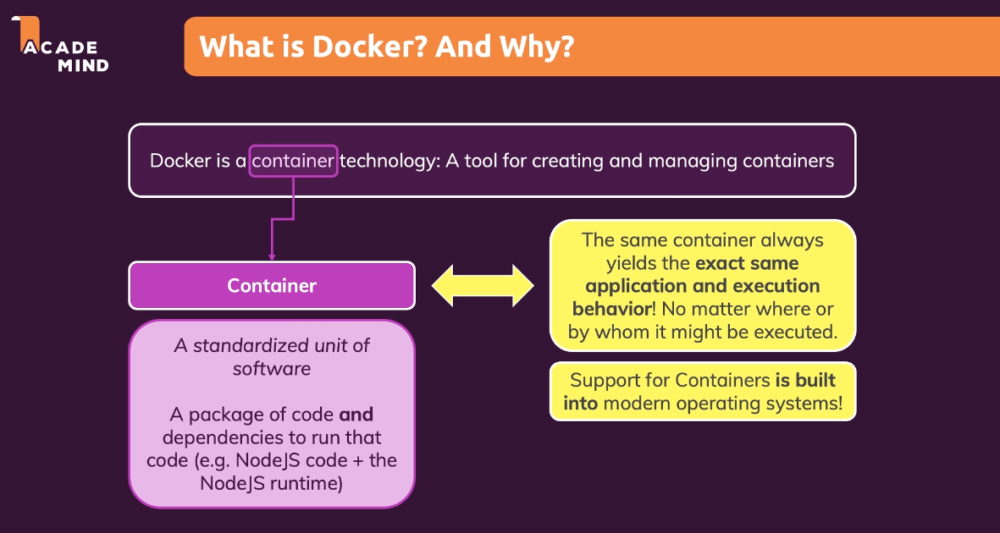
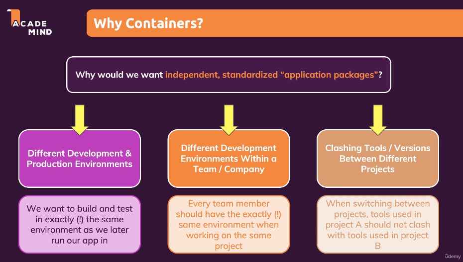

# Docker

- **Container technology**: Docker is a containerization platform used for creating and managing containers. Containers are a lightweight and portable way to encapsulate an application and its dependencies.
- **Container**: A container is a standardized unit of software that packages up code and all its dependencies so the application runs quickly and reliably from one computing environment to another.
    - **Explanation**: Containers provide a consistent environment for applications to run, regardless of the environment they are deployed in. This helps in ensuring that the application behaves the same way across different environments.
    - **Example**: If you have an application developed using Node.js that relies on a specific version of the Node.js runtime, you can package the application and its dependencies into a container. This ensures that the application runs consistently, even if the underlying host environment has a different version of Node.js installed.
- **Why containers?**:
    - **Need for independent, standardized application packages**: Containers provide a way to package applications and their dependencies into a single, standardized unit. This helps in ensuring that the application can run reliably across different environments without any issues.
    - **Different development and production environments**: Containers allow developers to create applications in a development environment and then deploy them in a production environment without any changes. This helps in reducing the chances of issues arising due to differences in environments.
    - **Example**: Consider a scenario where a developer is working on a Node.js application that uses the `for await` keyword, which is available only in Node.js versions 10 and above. If the production environment has an older version of Node.js installed, the application might not work as expected. By packaging the application into a container with the required version of Node.js, this issue can be avoided.
    - **Stand-alone and portable**: Docker containers can run on any machine that has Docker installed, making them stand-alone and portable. This means that you can package an application into a Docker container and then ship it to different environments where Docker is running without any extra installations required.
    - **Example**: If you have a Docker container that runs a web application, you can deploy this container to a different environment by simply copying the container image and running it with Docker, without needing to install any additional dependencies or configure the environment.

---

