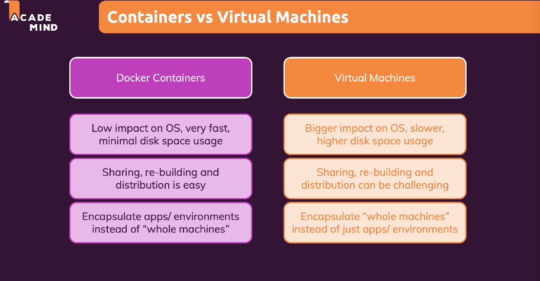
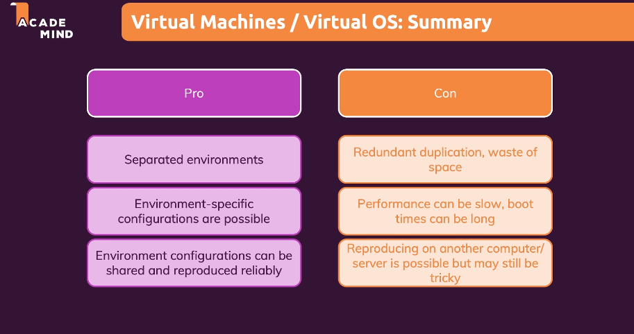

# Virtual Machines (VMs) vs. Docker

---

- **Why not use VMs instead of Docker?**:
  - **Overhead with multiple virtual machines**: Running multiple VMs on a single host can lead to resource overhead, as each VM requires its own operating system.
  - **Takes a lot of space and makes the system slow**: VMs can consume a significant amount of disk space and memory, which can impact the performance of the system.
- **Difference between VM and Docker**:
  - **VMs**: Virtual machines emulate a physical computer and can run their own operating systems and applications.
  - **Docker**: Docker uses containers to package and run applications. Containers share the host system's kernel and do not require a separate operating system, making them lightweight and efficient.
- **How Docker helps**:
  - **Containers**: Docker containers do not require the installation of a complete operating system, as they only include the application and its dependencies. This makes them more lightweight than VMs.
  - **Built-in OS emulation**: Docker provides a way to emulate container support without the need for multiple virtual machines.
  - **Docker Engine**: The Docker engine is lightweight and efficient, allowing for fast deployment and scaling of containers.
  - **Code and runtime encapsulation**: Docker containers encapsulate the code and runtime environment needed for an application, without including any unnecessary components.
  - **Configuration files**: Docker allows you to configure and describe containers using a Dockerfile or docker-compose.yml file, which can be shared with others to recreate the same environment.
  - **Low impact on OS, fast, minimal disk space usage**: Docker containers have a low impact on the host operating system, are fast to start and stop, and consume minimal disk space compared to VMs.
  - **Encapsulation of apps/environments**: Docker containers encapsulate applications and their environments, allowing for easy deployment and management of complex applications without the need for entire virtual machines.

---

